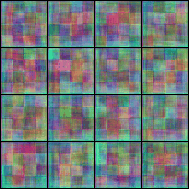

## Project Description

**Seeing Sounds II: Teaching AI to dream in sound by generating images from audio files**

This project explores how artificial intelligence can learn to "imagine" visuals from sounds by learning meaningful cross-modal relationships between audio features and visual generation. Using two separate strategies, our team first trained Stable Diffusion using CLAP audio embeddings, MLP-derived conditioning, and U-Net optimization, enabling the diffusion model to generate images from audio. We then introduced a custom GAN trained end-to-end on audio signals to learn direct cross-modal mapping. Both approaches produced visuals showing early semantic alignment with their audio inputs. Stable Diffusion generated more coherent and detailed imagery, while the GAN captured broader structural patterns derived from sound.

By combining techniques in scale consistency, fine-grained and broad multimodal mapping, our findings highlight the feasibility of multisensory generative systems and provide a solid foundation for future work such as embedding audio inside images for compact storage, generating visual equivalents of sound for the deaf or hard-of-hearing, and multimodal search. This approach brings us closer to AI capable of richer, more human-like sensory integration.

## VGGSound Data Preparation

This project processes the VGGSound dataset to extract representative frames and audio clips from video files. It uses OpenAI's CLIP model to select the video frame that best matches the video's caption (label).

### Overview

The core workflow involves:
1.  **Video Processing**: Iterating through video files.
2.  **Frame Selection**: Using CLIP (Contrastive Language-Image Pre-Training) to find the frame that semantically matches the video's label the best.
3.  **Audio Extraction**: Extracting the full audio track from the video.
4.  **Data Aggregation**: Compiling metadata (paths, filenames, captions) into a CSV file for downstream tasks.

### Prerequisites

The following Python libraries are required:

*   `pandas`
*   `opencv-python` (`cv2`)
*   `torch`
*   `Pillow` (`PIL`)
*   `transformers` (Hugging Face)
*   `moviepy`

### Workflow Description

#### 1. Setup and Model Loading
The script initializes the CLIP model (`openai/clip-vit-base-patch32`) and processor. It checks for CUDA availability to accelerate processing.

#### 2. Video Processing (`process_video_and_save_frame`)
For each video file:
*   **Metadata Extraction**: The YouTube ID and start timestamp are parsed from the filename.
*   **Caption Matching**: The script looks up the corresponding label (caption) from the `vggsound.csv` dataset.
*   **Frame Sampling**: The video is sampled at a rate of roughly 1 frame per second (1/10th of the FPS).
*   **CLIP Similarity**:
    *   The text caption is encoded into a text embedding.
    *   Each sampled frame is encoded into an image embedding.
    *   Cosine similarity is calculated between the text and image embeddings.
*   **Selection**: The frame with the highest similarity score is selected.
*   **Saving**: If the maximum similarity exceeds a threshold (0.25), the frame is saved as a `.png` file.

#### 3. Audio Extraction (`save_full_audio_moviepy`)
If a valid frame is found and saved, the script extracts the audio from the original video file and saves it as a `.wav` file using `moviepy`.

#### 4. Data Aggregation
The script iterates through the processed directories to verify the existence of image and audio pairs. It constructs a Pandas DataFrame containing:
*   `base_folder`: The source directory batch (e.g., `vggsound_00`).
*   `image_file`: The filename of the extracted frame.
*   `audio_file`: The filename of the extracted audio.
*   `caption`: The label associated with the clip.

Finally, duplicates are removed, and the dataset is saved to `main_dataV1.csv`.

### Files

*   `data_prep.ipynb`: The main Jupyter Notebook containing all the logic.
*   `main_dataV1.csv`: The generated dataset cataloging the processed files.
*   `main_dataV3.csv`: A versioned or filtered copy of the dataset.

### Usage

1.  Update the `base_paths` dictionary in the notebook to point to your local VGGSound data directories.
2.  Ensure `vggsound.csv` is available and the path is correctly set.
3.  Run the cells in `data_prep.ipynb` sequentially.


## Stable Diffusion (Dual Head)

### How It Works

The Stable Diffusion double-head approach uses a dual-head MLP adapter to project audio features into two distinct embedding spaces: one for CLAP text and one for Stable Diffusion (SD) text. This enables multi-task training, where the model learns both semantic alignment (InfoNCE loss with CLAP) and embedding compatibility (MSE loss with SD). During training, the model optimizes both heads simultaneously, allowing it to generate images from audio that are semantically meaningful and compatible with the SD generative process. U-Net optimization can be added to further fine-tune the image generation process, but the dual-head MLP is the core innovation that enables flexible, multi-modal mapping from audio to image.

The model uses a dual-head MLP to project CLAP audio embeddings into two spaces:
- **CLAP text space** (for semantic alignment)
- **Stable Diffusion (SD) text embedding space** (for image generation)

This enables multi-task training with three losses:
1. **InfoNCE loss** for CLAP alignment
2. **MSE loss** for SD embedding alignment
3. **Diffusion loss** for pixel-level image generation (optional, if fine-tuning UNet)

#### Model Architecture

**1. Audio Embedding**
Raw audio is encoded using the CLAP audio encoder:

$$
a = \text{CLAP}_\text{audio}(x_\text{audio})
$$

**2. Dual-Head MLP Projection**
The audio embedding $a$ is projected into two spaces:

$$
z_\text{CLAP}, z_\text{SD} = \text{MLP}_\text{dual}(a)
$$

where:
- $z_\text{CLAP}$: projected to CLAP text space
- $z_\text{SD}$: projected to SD text embedding space

**3. Target Embeddings**
Text captions are encoded using:
- CLAP text encoder: $t_\text{CLAP} = \text{CLAP}_\text{text}(x_\text{caption})$
- SD text encoder: $t_\text{SD} = \text{SD}_\text{text}(x_\text{caption})$

**4. Loss Functions**

**a. InfoNCE Loss (CLAP Alignment)**
Measures similarity between $z_\text{CLAP}$ and $t_\text{CLAP}$:

$$
\mathcal{L}_\text{CLAP} = \text{InfoNCE}(z_\text{CLAP}, t_\text{CLAP}, T)
$$

where $T$ is the temperature parameter.

In code:
```python
a, b = F.normalize(z_CLAP, dim=-1), F.normalize(t_CLAP, dim=-1)
logits = a @ b.t() / temp
tgt = torch.arange(a.size(0), device=a.device)
loss_CLAP = 0.5 * (F.cross_entropy(logits, tgt) + F.cross_entropy(logits.t(), tgt))
```

**b. MSE Loss (SD Embedding Alignment)**
Measures L2 distance between $z_\text{SD}$ and $t_\text{SD}$:

$$
\mathcal{L}_\text{SD} = \| z_\text{SD} - t_\text{SD} \|^2
$$

**c. Diffusion Loss (Optional, if fine-tuning UNet)**
Trains SD UNet to denoise images conditioned on audio:

$$
\mathcal{L}_\text{diff} = \text{MSE}(\text{UNet}(L_\text{noisy}, t_\text{audio}), \epsilon)
$$

where $L_\text{noisy}$ is the noisy latent, $t_\text{audio}$ is the audio conditioning, and $\epsilon$ is the true noise.

**5. Total Loss**
The total multi-task loss is:

$$
\mathcal{L}_\text{total} = w_1 \mathcal{L}_\text{CLAP} + w_2 \mathcal{L}_\text{SD} + w_3 \mathcal{L}_\text{diff}
$$

where $w_1$, $w_2$, $w_3$ are configurable weights.

**6. Inference**
For generation, only the SD head is used:
- Project audio to $z_\text{SD}$
- Insert $z_\text{SD}$ as a soft token in the SD text embedding sequence
- Generate image using Stable Diffusion pipeline

**Summary:**
The dual-head MLP enables the model to learn both semantic and generative mappings from audio to image, optimizing for both CLAP and SD spaces. Multi-task loss ensures robust training, and the architecture supports both evaluation and creative fusion modes.


### Project File & Folder Overview 
- **hf_model_hub**
	- `audio2image_mapper_dual_best.pt`: Holds the best model trained using MLP dual mapper + Unet Optimization.

- **hf_space**
	- `app.py`: Imports the model script, loads the best model, and provides the interface for the interactive demo in hugging space.
	- `main2.py`: Python script for dual-head MLP architecture with Unet Optimization; contains model architecture, training loop, evaluation logic, inference functions, dataset loading & preprocessing.
	- `requirements.txt`: Needed dependencies for Hugging Face deployment.

- `deploy_to_hf_hub.py`: Script to automate uploading the trained model and related files to the Hugging Face Model Hub.
- `app_audio2image.py`: The application interface for the audio-to-image model running on localhost.

- `hf_requirements_clean.txt`: Needed Python packages and dependencies for running the Hugging Face model.
- `main_dataV1.csv`: Dataset for training and evaluating the audio-to-image model; contains audio file paths, image file paths, and text captions.

- `main.py`: Python script for single-head MLP architecture without Unet Optimization.
- `main2.py`: Python script for dual-head MLP architecture with Unet Optimization; contains model architecture, training loop, evaluation logic, inference functions, dataset loading & preprocessing.
- `mlponly.py`: Python script for dual-head MLP optimization without Unet Optimization; contains model architecture, training loop, evaluation logic, inference functions, dataset loading & preprocessing.
- `main_dream_mode.py`: Uses main2’s model configurations; allows two audio inputs and fuses them using a fusion prompt rather than the base prompt.

- `audio2image_ui.html`: Local UI file & JavaScript functions for interactivity (button presses, etc.).
- `audio_2_image_mapper_dual_best`: Holds the best model trained using MLP dual mapper + Unet Optimization.
- `audio_2_image_mapper_dual_mlp_only_best`: Holds the best model trained using MLP dual mapper.

- `plot_training_loss.py`: Used to plot the training loss points from the training log for MLP (dual head) only model.
- `plot_unet_training_loss.py`: Used to plot the training loss points from the training log for MLP (dual head) + Unet optimized model.
- `requirements.txt`: Lists all dependencies needed for this project.
- `Seeing_Sound_II_MLP_ONLY.ipynb`: Training notebook for the MLP only model.
- `Seeing_Sound_II_MLP_UNET.ipynb`: Training notebook for the MLP + UNET model.

- `training_loss_curves.png`: Image generated from `plot_training_loss.py`.
- `unet_training_loss_curves.png`: Image generated from `plot_unet_training_loss.py`.

## Stable Diffusion (Single Head - SD Text Encoder & LoRA Fine Tuning)

### How It Works

This single-head approach implements a 4-phase audio-to-image generation pipeline using CLAP embeddings, MLP adaptation, and LoRA fine-tuning:

1. **MLP Training**: A 3-layer MLP (512→1024→1024→768) learns to map CLAP audio embeddings to Stable Diffusion's text embedding space using MSE (L2) loss to directly regress towards SD text encoder targets. Cosine similarity is computed during training only for monitoring and reporting, not as the optimization objective.
2. **LoRA Fine-tuning**: Stable Diffusion's U-Net is fine-tuned using LoRA (rank=16, alpha=16) on bird-specific audio-image pairs to improve domain-specific generation quality.
3. **Inference**: Input audio is encoded via CLAP, projected through the trained MLP adapter, then used to condition Stable Diffusion (with LoRA weights) for image generation.
4. **Evaluation**: Generated images are evaluated against text descriptions using CLIP similarity scores to measure performance improvements from LoRA fine-tuning.

### Model Architecture

#### MLP Adapter
The MLP adapter bridges CLAP audio embeddings to Stable Diffusion's text embedding space.
- **Input:** CLAP Audio Embedding $e \in \mathbb{R}^{512}$
- **Architecture:** Three-layer feedforward network with ReLU activations and dropout
- **Layers:** $512 \rightarrow 1024 \rightarrow 1024 \rightarrow 768$
- **Loss:** Mean squared error (MSE / L2) between projected audio embeddings and target SD text embeddings. (Cosine similarity is logged for monitoring but was not used as the training loss.)

$$ \text{MLP}(e) = W_3 \cdot \text{ReLU}(W_2 \cdot \text{ReLU}(W_1 \cdot e + b_1) + b_2) + b_3 $$

#### LoRA Fine-tuning
Low-Rank Adaptation modifies Stable Diffusion's U-Net attention layers for domain specialization.
- **Target Modules:** Query, Key, Value, and Output projections in attention blocks
- **Configuration:** Rank $r=16$, Alpha $\alpha=16$, Dropout $p=0.1$
- **Adaptation:** $W = W_0 + \frac{\alpha}{r} \cdot A \cdot B$ where $A \in \mathbb{R}^{d \times r}$, $B \in \mathbb{R}^{r \times k}$

$$ \text{Attention}(Q, K, V) = \text{softmax}\left(\frac{(Q + \Delta Q)(K + \Delta K)^T}{\sqrt{d_k}}\right)(V + \Delta V) $$

### Loss Functions

The model is trained using the following losses:

#### 1. MLP Training Loss
Mean squared error between projected audio embeddings and target SD text embeddings.

$$ L_{MLP} = \frac{1}{N} \sum_{i=1}^{N} ||\underbrace{\text{MLP}(e_i)}_{\text{Projected Audio}} - \underbrace{t_{SD,i}}_{\text{Target SD Embedding}}||_2^2 $$

where $e_i$ is the CLAP audio embedding and $t_{SD,i}$ is the corresponding SD text embedding.

#### 2. LoRA Fine-tuning Loss
Standard diffusion loss for training the U-Net with LoRA adapters.

$$ L_{LoRA} = \mathbb{E}_{x_0, \epsilon \sim \mathcal{N}(0,I), t} \left[ ||\underbrace{\epsilon}_{\text{True Noise}} - \underbrace{\epsilon_{\theta}(\sqrt{\bar{\alpha}_t}x_0 + \sqrt{1-\bar{\alpha}_t}\epsilon, t, c)}_{\text{Predicted Noise}}||_2^2 \right] $$

where:
- $x_0$ is the ground truth image
- $\epsilon$ is the noise added at timestep $t$
- $c$ is the conditioning (projected audio embedding)
- $\epsilon_{\theta}$ is the U-Net with LoRA adapters

### Project File & Folder Overview 
- **bird_specialist_lora.safetensors/**
    - `adapter_config.json`: LoRA adapter configuration file specifying target modules, rank, alpha, and other hyperparameters.
    - `adapter_model.safetensors`: Trained LoRA weights for bird-specialized Stable Diffusion fine-tuning.
    - `README.md`: Model card documentation for the LoRA adapter with training details and usage instructions.

- `bird_filter.py`: Script to filter the main dataset for bird-related audio samples and verify file existence.
- `bird_sounds_filtered.csv`: Filtered dataset containing only bird-related audio-image pairs (421 entries).
- `diva_model.ipynb`: Complete training pipeline notebook implementing MLP training, LoRA fine-tuning, inference, and CLIP evaluation.
- `MLP.pth`: Trained MLP adapter model for mapping CLAP audio embeddings to Stable Diffusion text embedding space.

- `bird_lora_loss_curve.png`: Training loss visualization for the bird-specialized LoRA fine-tuning process.
- `comparison_frozen_vs_lora.png`: Side-by-side comparison of generated images before and after LoRA fine-tuning.
- `evaluation_with_clip_scores.png`: CLIP score evaluation results comparing model performance before and after fine-tuning.
- `mlp_training.png`: Training progress visualization for the MLP adapter training phase.


## Stable Diffusion (Single Head - CLIP)

### How It Works
This single-head approach implements a two-stage training pipeline designed to enable Stable Diffusion to interpret audio cues by aligning audio embeddings with text semantics:
1. **MLP Alignment (Supervised)**: A lightweight MLP adapter (Linear → GELU → Linear) is trained to map frozen CLAP audio embeddings directly into the CLIP text latent space. Unlike standard regression, this uses **Cosine Similarity Loss** to force the projected audio vector to align directionally with ground-truth text embeddings, treating text as the semantic target.
2. **End-to-End Fine-Tuning**: The pre-trained adapter is chained into the Stable Diffusion UNet for full fine-tuning using **Hybrid Conditioning** (fusing audio and text embeddings). To prevent model collapse, we utilize **Differential Learning Rates** (microscopic for UNet, higher for Adapter), **bfloat16** precision, and dropout.
3. **Inference**: Input audio is encoded via CLAP and projected through the fine-tuned adapter. This projection is combined with text prompts to condition the Stable Diffusion UNet (using the **Euler Ancestral** scheduler), generating images that reflect the semantic content of the audio.
4. **Evaluation**: The model's performance is benchmarked on unseen audio samples using **CLIP Semantic Similarity**. We calculate the cosine similarity between the generated image and the original text caption to objectively measure the translation of audio signals into visual concepts.

### Model Architecture
#### MLP Adapter
The MLP adapter acts as a semantic bridge, translating CLAP audio embeddings into the CLIP text embedding space used by Stable Diffusion.
- **Input**: CLAP Audio Embedding $e \in \mathbb{R}^{512}$
- **Architecture**: A feedforward network consisting of an alignment adapter followed by a projection layer.
- **Layers**: $512 \rightarrow 1024 \rightarrow 512 \rightarrow 768$
- **Activation**: GELU (Gaussian Error Linear Unit)
- **Loss**: Cosine Similarity Loss ($1 - \text{CosineSim}$) used directly for optimization to enforce directional alignment between projected audio and target text embeddings.

$$e_{cond} = W_{proj} \cdot (W_2 \cdot \text{GELU}(W_1 \cdot e + b_1) + b_2) + b_{proj}$$

#### Stable Diffusion Fine-Tuning
Unlike standard LoRA approaches, this architecture employs full fine-tuning of the U-Net to deeply integrate audio conditioning.
- **Backbone**: Stable Diffusion v1.5 U-Net
- **Conditioning Strategy**: Hybrid Fusion (Averaging Audio + Text Embeddings)
- **Optimization**: Differential Learning Rates (Adapter: $1e^{-6}$, U-Net: $5e^{-9}$) using **bfloat16** precision to prevent numerical instability.

### Loss Functions
The pipeline uses contrastive optimization strategies for both stages to ensure semantic alignment:

#### 1. MLP Alignment Loss (Stage 1)
Instead of Mean Squared Error (MSE), we utilized **Cosine Similarity Loss** to train the adapter. This forces the projected audio vector to align with the direction of the ground-truth text embedding in the CLIP latent space, focusing on semantic orientation rather than magnitude.

$$L_{Align} = 1 - \text{CosineSim}(\underbrace{\text{MLP}(e_{audio})}_{\text{Projected Audio}}, \underbrace{e_{text}}_{\text{Target CLIP Text}})$$

#### 2. Fine-Tuning Semantic Loss (Stage 2)
For end-to-end fine-tuning, we replaced the standard noise-prediction loss with a **CLIP Semantic Loss**. The model generates a denoised image estimate $I_{gen}$, which is then encoded by CLIP and compared against the original text caption. This directly optimizes the model to generate images that match the semantic meaning of the audio-derived prompt.

$$L_{Semantic} = 1 - \text{CosineSim}(\underbrace{E_{img}(I_{gen})}_{\text{Generated Image Feature}}, \underbrace{E_{txt}(y)}_{\text{Prompt Feature}})$$

where:
- $I_{gen}$ is the predicted original image decoded from latents
- $E_{img}$ and $E_{txt}$ are the frozen CLIP Image and Text encoders
- $y$ is the text prompt associated with the audio

## GANs

The GANs implementation uses a **Conditional Wasserstein GAN with Gradient Penalty (WGAN-GP)** to generate 64x64 pixel images conditioned on audio embeddings. It leverages **SPADE (Spatially-Adaptive Normalization)** in the generator and a **Projection Discriminator** to effectively fuse audio information into the visual generation process.

### How It Works

The model consists of two main components: a **Generator** and a **Discriminator**, which play a minimax game.

1.  **Generator ($G$):** Takes a random noise vector ($z$) and an audio embedding ($e$) as input. It progressively upsamples the noise to generate an image. The audio embedding modulates the features at each layer using **SPADE** blocks, ensuring the generated image structure is guided by the audio context.
2.  **Discriminator ($D$):** Takes an image (real or generated) and the corresponding audio embedding as input. It tries to distinguish between real images from the dataset and fake images produced by the generator. It uses a **Projection** mechanism to measure the compatibility between the image and the audio.

The training process uses the **WGAN-GP** objective for stability, augmented with **Feature Matching Loss** and an optional **LPIPS Perceptual Loss** to improve image quality and diversity.

#### Model Architecture

##### Generator
The generator uses a ResNet-based architecture with **SPADE** normalization blocks.
- **Input:** Noise vector $z \in \mathbb{R}^{128}$, Audio Embedding $e \in \mathbb{R}^{512}$.
- **SPADE Block:** Instead of standard Batch Normalization, SPADE modulates the normalized activation using learned scale ($\gamma$) and bias ($\beta$) parameters derived from the audio embedding.

$$ \gamma = \text{Conv}(\text{ReLU}(\text{Conv}(\text{ProjectedEmbedding}))) $$
$$ \beta = \text{Conv}(\text{ReLU}(\text{Conv}(\text{ProjectedEmbedding}))) $$
$$ \text{SPADE}(x, e) = \frac{x - \mu}{\sigma} \cdot (1 + \gamma(e)) + \beta(e) $$

- **Self-Attention:** Applied at 32x32 and 64x64 resolutions to capture long-range dependencies.

##### Discriminator
The discriminator is a **Projection Discriminator** with **Spectral Normalization**.
- **Architecture:** A series of downsampling convolutional blocks with Spectral Normalization.
- **Projection:** The final score is a combination of a global realism score and a conditional compatibility score (dot product of image features and projected audio embedding).

$$ D(x, e) = \underbrace{\psi(x)^T \phi(e)}_{\text{Conditional Score}} + \underbrace{\psi'(x)}_{\text{Realism Score}} $$
where $\psi(x)$ are the image features and $\phi(e)$ is the projected audio embedding.

#### Loss Functions

The model is trained using the following losses:

##### 1. WGAN-GP Loss (Discriminator)
Ensures 1-Lipschitz continuity for the critic using a gradient penalty.

$$ L_D = \underbrace{\mathbb{E}_{\tilde{x} \sim P_g}[D(\tilde{x}, e)] - \mathbb{E}_{x \sim P_r}[D(x, e)]}_{\text{Wasserstein Loss}} + \lambda_{gp} \underbrace{\mathbb{E}_{\hat{x} \sim P_{\hat{x}}}[(||\nabla_{\hat{x}} D(\hat{x}, e)||_2 - 1)^2]}_{\text{Gradient Penalty}} $$

##### 2. Generator Loss
Combines adversarial loss with feature matching and perceptual loss.

$$ L_G = \underbrace{-\mathbb{E}_{\tilde{x} \sim P_g}[D(\tilde{x}, e)]}_{\text{Adversarial Loss}} + \lambda_{fm} L_{fm} + \lambda_{lpips} L_{lpips} $$

- **Feature Matching ($L_{fm}$):** Matches the statistics of the discriminator's intermediate features for real and fake images.
  $$ L_{fm} = ||D_{feat}(x) - D_{feat}(\tilde{x})||_1 $$
- **LPIPS ($L_{lpips}$):** (Optional) Perceptual loss using a pre-trained VGG network to ensure the generated image is perceptually similar to the target (if paired data is used/available in that context).

#### Training

The training loop is implemented in `trainer.py` and can be executed via the `train.ipynb` notebook.

- **Optimizer:** Adam ($\beta_1=0.0, \beta_2=0.9$)
- **EMA:** Exponential Moving Average of generator weights is maintained for inference to produce higher quality samples.
- **n_critic:** The discriminator is updated 4 times for every generator update.

#### Training Progress

Below is a visualization of the training progress over time:



### Project File & Folder Overview 

